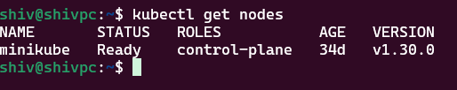

# wsl-podman-k8s
Tells how to setup podman desktop with k8s and use wsl to interact with k8s. This is mainly for Windows system.

## Pre-requisites
- have wsl 2 version installed, reference => https://learn.microsoft.com/en-us/windows/wsl/install
- podman desktop for windows, reference => https://podman-desktop.io/docs/installation/windows-install
- recommended to have 16GB ram laptop (to run podman and local k8s cluster)


# Steps
## configurations in podman desktop (Windows system)
- once the podmand desktop is installed, it will prompt for installing few extensions. Select next and install all.
Enable below extensions if not enabled:


Mainly kubectl and minikube extensions are needed.

- Go to settings page and you will see Minikube cluster options.


- click on create minikube cluster and choose container runtime


## configurations in WSL
once the minikube cluster is ready , you can view the kubeconfig file created by minikube in your windows system. Below it is shown inside WSL


⚡**NOTE**:  
- now we see that kubeconfig file contains certs related to K8s cluster and the user(you) that is used for authentication when user runs kubectl commands.
- what we need is natively run kubectl commands inside wsl terminal to be more of linux oriented.
- we will pull the certs and kubeconfig file inside wsl terminal, modify the kubeconfig file such that it reads certs from wsl.
- now with this setup, we will install kubectl inside wsl and test connecting from WSL to k8s cluster in windows system

⚡**WHY THIS WORKS**:
- WSL and Windows might be attached to different network interface but there is connectivity provided by Windows which uses loopback(localhost) mechanism.
- Here k8s is running in Windows localhost:(port), WSL will first check if service is running inside WSL env in that port else it will check in Windows localhost.

## final steps
- install kubectl tool in WSL
    ```
    curl -LO "https://dl.k8s.io/release/$(curl -L -s https://dl.k8s.io/release/stable.txt)/bin/linux/amd64/kubectl"
    sudo install -o root -g root -m 0755 kubectl /usr/local/bin/kubectl
    ```
- copy kubeconfig and certs from Windows inside WSL **(do inside home directory)** [please change user name and path if needed]
    ```
    mkdir .kube
    cd .kube
    cp /mnt/c/Users/Shivaprasad\ MB/.kube/config .
    cp /mnt/c/Users/Shivaprasad\ MB/.minikube/profiles/minikube/client.key .
    cp /mnt/c/Users/Shivaprasad\ MB/.minikube/profiles/minikube/client.crt .
    ```
- modify .kube/config file inside WSL as shown below


## TESTING
- test running kubectl commands



### Awesome! You’ve successfully set up Kubernetes 🐳 and WSL 🐧 and connected them 🎉. 
